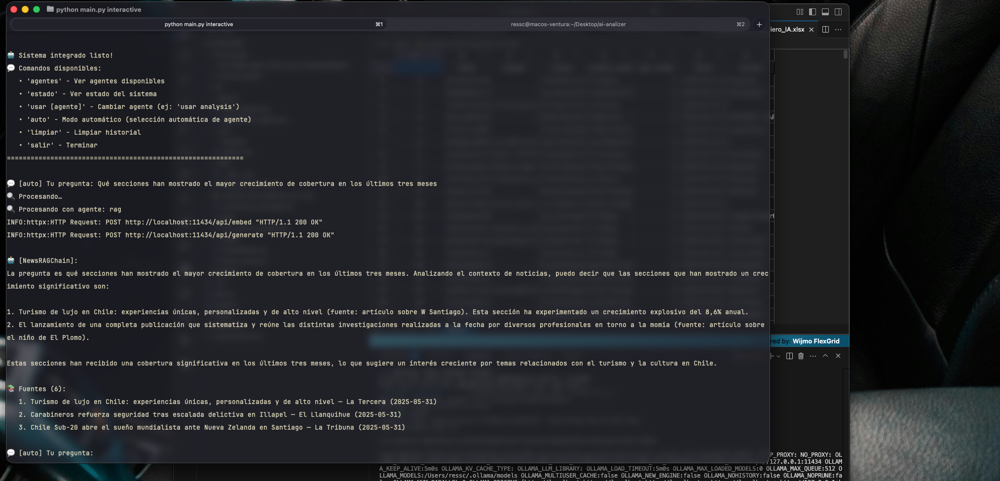

# 📰 AI‑Analizer

Sistema de análisis inteligente de noticias construido con **LangChain + LangGraph**, agentes especializados y una interfaz **Streamlit**.



Con agentes especializados la IA convierte las noticias entregadas en insights claros, en tiempo real y sin trabajo manual - esto puede ser llevado a documentos tecnicos, soluciones o depende de area que se quiera integrar. Cada agente resuelve un paso (buscar, analizar, comparar segun lo programado) y el grafo los coordina, así el sistema escala y se amplía fácil. El proyecto demostró esto: indexó una vez los datos, respondió consultas complejas al instante y entregó información lista para decidir, mostrando el valor directo de adoptar esta arquitectura en la empresa.

Capturas en IMG y en el CSV una prueba en entorno local.

---

## Tabla de contenido

1. [Características principales](#características-principales)
2. [Arquitectura](#arquitectura)
3. [Requisitos](#requisitos)
4. [Instalación](#instalación)

   * [Usando Pipenv](#usando-pipenv)
   * [Usando `requirements.txt`](#usando-requirementstxt)
5. [Ejecución](#ejecución)

   * [Verificador de entorno](#verificador-de-entorno)
   * [Aplicación Streamlit](#aplicación-streamlit)
   * [CLI interactiva](#cli-interactiva)
   * [Informe batch automático](#informe-batch-automático)
6. [Estructura del proyecto](#estructura-del-proyecto)
7. [Variables de entorno](#variables-de-entorno)
8. [Comandos útiles](#comandos-útiles)
9. [Contribución](#contribución)

---

## Características principales

* **ETL de noticias** en Excel (`NewsDataProcessor`).
* **Vector‑store ChromaDB** con embeddings de *Sentence‑Transformers*.
* **RAG** con Llama 3 vía **Ollama**.
* **Agentes base** (text, analysis, conversational) + **agentes especializados** (clustering, temporal, comparativo…).
* **LangGraph** para orquestar flujos complejos.
* **Verificador de sistema** (`SystemChecker`) – Chequea Python, dependencias, Ollama, estructura.
* **Streamlit app** con dashboard, chat, análisis automático y exportación (CSV/Excel).
* **CLI interactiva** (`python main.py interactive`) para pruebas rápidas.
* **Modo lote**: genera un JSON con respuestas a preguntas predefinidas.

## Arquitectura

```text
Excel → DataProcessor → ChromaDB (VectorStore) ←→ RAG (LangChain)
                                       ↑
                Agents (Base & Specialized) ← LangGraph workflow
                                       ↑
                                 Streamlit UI / CLI
```

> **Nota:** El módulo `src/utils/system_checker.py` se ejecuta antes de inicializar todo para garantizar que el entorno esté listo.

## Requisitos

* **Python ≥ 3.11**
* **Ollama** corriendo localmente (`ollama serve`).
* Modelo **Llama 3** indicado en tu `.env` (p. ej. `llama3:8b`) **descargado previamente**:

  ```bash
  ollama pull llama3:8b   # o el que indiques en LLAMA_MODEL
  ```
* Paquetes del proyecto instalados con **Pipenv** o **requirements.txt**.
* (Opcional) **Homebrew** si usas macOS para facilitar la instalación de Python y Ollama.

> ⏱️ **Rendimiento**: el tiempo de inicialización (creación del vector‑store y consultas) depende directamente de la velocidad de tu CPU/GPU y disco. Las pruebas se realizaron en un **MacBook Pro M1** con 16 GB RAM utilizando Homebrew como gestor de paquetes.

---

## Instalación

### Usando Pipenv

```bash
# 1. Clona el repo
$ git clone https://github.com/tu‑usuario/ai‑analizer.git
$ cd ai‑analizer

# 2. Instala dependencias + crea venv
$ pipenv install --python 3.11

# 3. Activa el entorno
$ pipenv shell
```

### Usando `requirements.txt`

```bash
# Crea y activa un venv (opcional)
$ python -m venv .venv && source .venv/bin/activate

# Instala dependencias
$ pip install -r requirements.txt
```

## Ejecución

### Verificador de entorno

Ejecuta **antes** de todo para detectar problemas:

```bash
$ python main.py verify        # o python verify.py
```

### Aplicación Streamlit

```bash
$ streamlit run app.py
```

*Sube tu Excel → “Procesar Dataset” → “Crear Vector Store” y comienza a explorar.*

### CLI interactiva

```bash
$ python main.py interactive
```

Comandos disponibles dentro del prompt:

```
agentes   # lista agentes
auto      # modo automático
usar analysis    # fuerza un agente
estado    # muestra health snapshot
limpiar   # borra historial
salir     # termina
```

### Informe batch automático

Por defecto responde a 5 preguntas y guarda un JSON:

```bash
$ python main.py
```

Preguntas personalizadas (separadas por `||`):

```bash
$ REPORT_QUESTIONS="¿Qué dice la prensa sobre IA?||Compara sentimiento en economía" python main.py
```

## Estructura del proyecto

```text
ai-analizer/
├── app.py                # Front‑end Streamlit (dashboard + chat)
├── main.py               # Entrypoint CLI + batch + integración completa
├── verify.py             # Verificador de entorno (opcional)
├── README.md             # Este documento
├── .env                  # Configuración local
├── requirements.txt      # Dependencias (pip) / Pipfile para Pipenv
├── chroma_db/            # Persistencia del vector‑store (se autogenera)
└── src/
    ├── core/
    │   ├── system.py     # `IntegratedNewsSystem` – motor reutilizable
    │   └── uploads/      # Excel subido vía Streamlit (copia)
    ├── agents/
    │   ├── llama_agents.py        # Agentes base (text, analysis, conversational)
    │   ├── specialized_agents.py  # Fábrica y health‑check de agentes temáticos
    │   └── new_agents_graph.py    # Grafo LangGraph con agentes de noticias
    ├── data/
    │   ├── __init__.py
    │   ├── data_processor.py      # ETL y limpieza de Excel
    │   ├── vectorstore_manager.py # Crea / carga ChromaDB, estadísticas
    │   └── noticias_test_ingeniero_IA.xlsx  # Dataset de ejemplo
    ├── graph/
    │   └── ...                    # (espacio para futuros flujos LangGraph)
    ├── models/
    │   ├── embeddings.py          # Plantilla para embeddings locales
    │   └── llama_setup.py         # Script para configurar modelo en Ollama
    └── utils/
        └── system_checker.py      # Clase `SystemChecker` usada por verify.py
```

### Desglose rápido de cada módulo

| Archivo / carpeta                     | Rol principal                                                                                                                        |
| ------------------------------------- | ------------------------------------------------------------------------------------------------------------------------------------ |
| **app.py**                            | Interfaz Streamlit: carga Excel, crea vector‑store, visualiza insights, exporta CSV/Excel.                                           |
| **main.py**                           | Punto de entrada por consola: ejecuta pre‑flight (SystemChecker), inicializa `IntegratedNewsSystem`, modo demo, batch o interactivo. |
| **verify.py**                         | Script independiente que solo corre `SystemChecker`.                                                                                 |
| **src/core/system.py**                | Clase *única fuente de verdad* que orquesta procesador de datos, vector‑store, RAG y agentes.                                        |
| **src/agents/llama\_agents.py**       | Wrapper de agentes “base” simples (text, analysis, conversational) sobre Llama.                                                      |
| **src/agents/specialized\_agents.py** | Registra y devuelve agentes temáticos (temporal, comparativo, síntesis…).                                                            |
| **src/agents/new\_agents\_graph.py**  | Implementa un flujo LangGraph que combina los agentes para análisis complejos.                                                       |
| **src/data/data\_processor.py**       | Limpia el Excel, normaliza fechas/columnas y genera `Document` para embeddings.                                                      |
| **src/data/vectorstore\_manager.py**  | Capa de persistencia: crea / abre ChromaDB, inserta documentos, reporta stats.                                                       |
| **models/**                           | Espacio para código relacionado con embeddings o pipelines ML adicionales.                                                           |
| **utils/system\_checker.py**          | Comprueba dependencias, estructura, Ollama, etc. Devuelve reporte GOOD/WARNING/ERROR.                                                |
| **chroma\_db/**                       | Almacén de vectores en disco (se auto‑crea; puedes borrarlo para re‑indexar).                                                        |

---

## Variables de entorno

Colócalas en `.env` o exporta en tu shell (*defaults mostrados*):

```env
OLLAMA_BASE_URL=http://localhost:11434
LLAMA_MODEL=llama3:8b
CHROMA_PERSIST_DIRECTORY=./chroma_db
COLLECTION_NAME=news_collection
CHUNK_SIZE=1000
CHUNK_OVERLAP=200
AGENT_CONFIG_ENV=development
```

## Comandos útiles

| Tarea                          | Comando                                  |
| ------------------------------ | ---------------------------------------- |
| Instalar deps (Pipenv)         | `pipenv install`                         |
| Exportar deps                  | `pipenv requirements > requirements.txt` |
| Crear vector‑store limpio      | Elimina `chroma_db/` y ejecuta app/CLI   |
| Actualizar estado en Streamlit | Botón 🔄 “Actualizar Estado”             |
| Ejecutar tests                 | `pytest -q`                              |

## Notas de rendimiento y alcance del desarrollo

* El proyecto se desarrolló en un **periodo acotado**; es posible que encuentres oportunidades de refactor o mejora de UX.
* Para optimizar tiempos de respuesta:

  * Mantén Ollama cargado con el modelo en memoria.
  * Ajusta `CHUNK_SIZE` y `CHUNK_OVERLAP` en `.env` según tus recursos.
  * Considera usar un modelo más pequeño si tu equipo es limitado.

---

